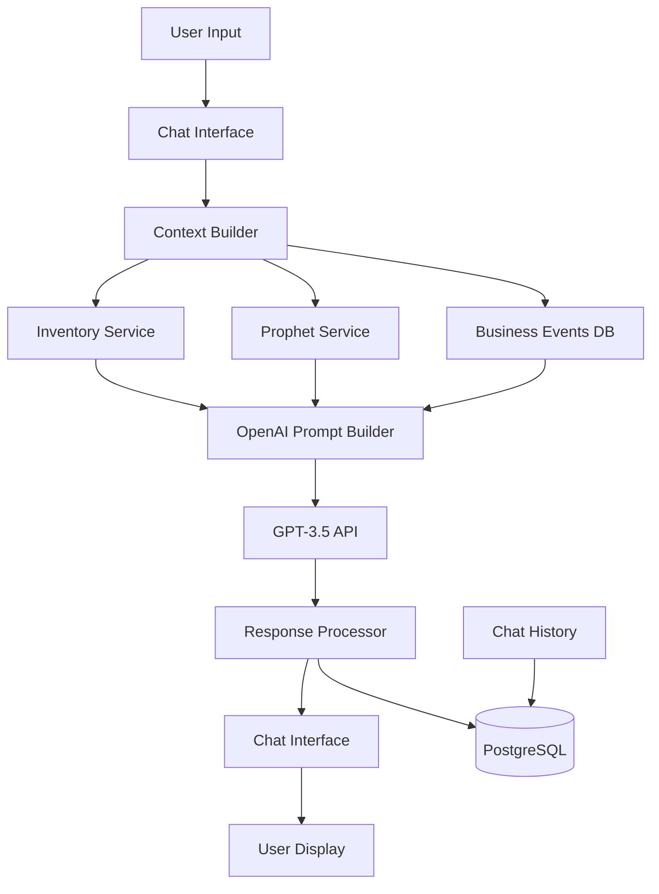

# AI Chatbot Implementation Strategy - Technical Architecture

## Overview

This document outlines the technical implementation strategy for integrating an AI-powered conversational chatbot into the existing Inventory Forecasting Dashboard. The chatbot will provide explainable AI recommendations by combining GPT-3.5-turbo with Prophet forecasting data to deliver contextual, story-driven insights to SME users.

## System Architecture

### Core Components

```typescript
interface ChatbotArchitecture {
  frontend: {
    chatInterface: "React component with existing UI theme";
    stateManagement: "Zustand store for chat history and context";
    streaming: "Server-sent events for typing indicators";
  };
  backend: {
    chatEngine: "Express.js endpoints with OpenAI integration";
    contextBuilder: "Data aggregation from existing Prophet service";
    responseProcessor: "Template-based prompt generation";
  };
  integrations: {
    openai: "GPT-3.5-turbo API for natural language processing";
    prophet: "Existing forecasting microservice for data context";
    database: "PostgreSQL for chat history and analytics";
  };
}
```

### Data Flow Architecture



## Implementation Chunks

### Chunk 1: Database Schema Extension

```sql
-- Chat conversations table
CREATE TABLE chat_conversations (
  conversation_id UUID PRIMARY KEY DEFAULT gen_random_uuid(),
  user_id UUID NOT NULL REFERENCES users(user_id),
  store_id UUID REFERENCES stores(store_id),
  created_at TIMESTAMP WITH TIME ZONE DEFAULT NOW(),
  updated_at TIMESTAMP WITH TIME ZONE DEFAULT NOW(),
  conversation_title VARCHAR(255),
  is_active BOOLEAN DEFAULT TRUE
);

-- Individual chat messages
CREATE TABLE chat_messages (
  message_id UUID PRIMARY KEY DEFAULT gen_random_uuid(),
  conversation_id UUID NOT NULL REFERENCES chat_conversations(conversation_id),
  message_type VARCHAR(20) NOT NULL CHECK (message_type IN ('user', 'assistant', 'system')),
  content TEXT NOT NULL,
  metadata JSONB DEFAULT '{}',
  created_at TIMESTAMP WITH TIME ZONE DEFAULT NOW(),
  tokens_used INTEGER DEFAULT 0,
  response_time_ms INTEGER
);

-- Chat analytics for optimization
CREATE TABLE chat_analytics (
  analytics_id UUID PRIMARY KEY DEFAULT gen_random_uuid(),
  user_id UUID NOT NULL REFERENCES users(user_id),
  question_category VARCHAR(100),
  user_satisfaction INTEGER CHECK (user_satisfaction >= 1 AND user_satisfaction <= 5),
  was_helpful BOOLEAN,
  follow_up_action VARCHAR(100),
  created_at TIMESTAMP WITH TIME ZONE DEFAULT NOW()
);

-- Indexes for performance
CREATE INDEX idx_chat_conversations_user_active ON chat_conversations(user_id, is_active);
CREATE INDEX idx_chat_messages_conversation_time ON chat_messages(conversation_id, created_at);
CREATE INDEX idx_chat_analytics_category_time ON chat_analytics(question_category, created_at);
```

### Chunk 2: Context Builder Service

```typescript
// services/chatContextBuilder.ts
import { InventoryService } from './inventoryService';
import { ForecastService } from './forecastService';
import { BusinessEventService } from './businessEventService';

interface ChatContext {
  user: UserProfile;
  store: StoreData;
  inventory: InventorySnapshot;
  forecasts: ForecastData[];
  seasonalPatterns: SeasonalPattern[];
  recentEvents: BusinessEvent[];
  salesTrends: TrendAnalysis;
  timestamp: Date;
}

interface InventorySnapshot {
  totalProducts: number;
  lowStockProducts: ProductSummary[];
  overstockProducts: ProductSummary[];
  reorderSuggestions: ReorderSuggestion[];
  inventoryValue: number;
  topPerformers: ProductSummary[];
}

interface ForecastData {
  productId: string;
  productName: string;
  currentStock: number;
  predictedDemand: ForecastPrediction[];
  confidence: number;
  seasonalFactors: SeasonalFactor[];
  trendDirection: 'up' | 'down' | 'stable';
  riskFactors: string[];
}

export class ChatContextBuilder {
  constructor(
    private inventoryService: InventoryService,
    private forecastService: ForecastService,
    private businessEventService: BusinessEventService
  ) {}

  async buildContext(userId: string, storeId: string, userMessage: string): Promise<ChatContext> {
    try {
      // Parallel data fetching for performance
      const [user, store, inventory, forecasts, patterns, events, trends] = await Promise.all([
        this.getUserProfile(userId),
        this.getStoreData(storeId),
        this.inventoryService.getInventorySnapshot(storeId),
        this.forecastService.getActiveForecasts(storeId),
        this.forecastService.getSeasonalPatterns(storeId),
        this.businessEventService.getRecentEvents(storeId, 90), // Last 90 days
        this.inventoryService.getSalesTrends(storeId, 30) // Last 30 days
      ]);

      // Filter relevant data based on user message
      const relevantData = this.filterRelevantData(
        { inventory, forecasts, patterns, events, trends }, 
        userMessage
      );

      return {
        user,
        store,
        inventory: relevantData.inventory,
        forecasts: relevantData.forecasts,
        seasonalPatterns: relevantData.patterns,
        recentEvents: relevantData.events,
        salesTrends: relevantData.trends,
        timestamp: new Date()
      };
    } catch (error) {
      console.error('Error building chat context:', error);
      throw new Error('Failed to build context for chat response');
    }
  }

  private filterRelevantData(data: any, userMessage: string) {
    // Extract product names, categories, or keywords from user message
    const keywords = this.extractKeywords(userMessage.toLowerCase());
    
    // Filter forecasts and inventory based on relevance
    const relevantForecasts = data.forecasts.filter(forecast => 
      keywords.some(keyword => 
        forecast.productName.toLowerCase().includes(keyword) ||
        forecast.category?.toLowerCase().includes(keyword)
      )
    );

    // If no specific products mentioned, return summary data
    if (relevantForecasts.length === 0) {
      return {
        inventory: this.summarizeInventory(data.inventory),
        forecasts: data.forecasts.slice(0, 5), // Top 5 most relevant
        patterns: data.patterns,
        events: data.events,
        trends: data.trends
      };
    }

    return {
      inventory: data.inventory,
      forecasts: relevantForecasts,
      patterns: data.patterns,
      events: data.events,
      trends: data.trends
    };
  }

  private extractKeywords(message: string): string[] {
    // Simple keyword extraction - can be enhanced with NLP
    const productKeywords = message.match(/\b\w+(?:\s+\w+)?\b/g) || [];
    const actionKeywords = ['reorder', 'stock', 'forecast', 'seasonal', 'trend'];
    
    return [...productKeywords, ...actionKeywords.filter(keyword => message.includes(keyword))];
  }

  private summarizeInventory(inventory: InventorySnapshot) {
    return {
      ...inventory,
      lowStockProducts: inventory.lowStockProducts.slice(0, 3),
      reorderSuggestions: inventory.reorderSuggestions.slice(0, 3)
    };
  }
}
```

### Chunk 3: Prompt Engineering Service

```typescript
// services/promptEngineering.ts
interface PromptTemplate {
  name: string;
  template: string;
  maxTokens: number;
  temperature: number;
}

interface PromptContext {
  userMessage: string;
  chatContext: ChatContext;
  conversationHistory: ChatMessage[];
  intentCategory: IntentCategory;
}

enum IntentCategory {
  REORDER_ADVICE = 'reorder_advice',
  FORECAST_EXPLANATION = 'forecast_explanation',
  SEASONAL_INSIGHTS = 'seasonal_insights',
  GENERAL_INQUIRY = 'general_inquiry',
  TREND_ANALYSIS = 'trend_analysis',
  STOCK_STATUS = 'stock_status'
}

export class PromptEngineeringService {
  private templates: Map<IntentCategory, PromptTemplate> = new Map();

  constructor() {
    this.initializeTemplates();
  }

  private initializeTemplates() {
    this.templates.set(IntentCategory.REORDER_ADVICE, {
      name: 'reorder_advice',
      template: `You are an experienced inventory expert helping a small business owner make reorder decisions.

BUSINESS CONTEXT:
- Store: {storeName}
- Current date: {currentDate}
- Business type: {businessType}

INVENTORY DATA:
- Total products: {totalProducts}
- Low stock items: {lowStockCount}
- Current inventory value: ${inventoryValue}

SPECIFIC PRODUCT DATA:
{productData}

SEASONAL PATTERNS:
{seasonalPatterns}

RECENT TRENDS:
{recentTrends}

USER QUESTION: "{userMessage}"

Please provide a friendly, conversational response that:
1. Directly answers their question about reordering
2. References specific numbers from the data
3. Explains the reasoning behind your recommendation
4. Mentions any relevant seasonal or trend factors
5. Suggests specific quantities and timing
6. Keeps the response under 150 words
7. Uses a supportive, expert tone

Format your response as natural conversation, not bullet points.`,
      maxTokens: 200,
      temperature: 0.3
    });

    this.templates.set(IntentCategory.FORECAST_EXPLANATION, {
      name: 'forecast_explanation',
      template: `You are an AI inventory assistant explaining forecast predictions to a business owner.

FORECAST DATA:
{forecastData}

HISTORICAL CONTEXT:
{historicalContext}

CONFIDENCE FACTORS:
{confidenceFactors}

USER QUESTION: "{userMessage}"

Explain the forecast in simple terms by:
1. Stating the prediction clearly
2. Explaining what data led to this prediction
3. Mentioning the confidence level and why
4. Highlighting any important patterns or trends
5. Suggesting how to use this information
6. Keeping it conversational and under 150 words

Avoid technical jargon and focus on actionable insights.`,
      maxTokens: 200,
      temperature: 0.2
    });

    this.templates.set(IntentCategory.SEASONAL_INSIGHTS, {
      name: 'seasonal_insights',
      template: `You are helping a business owner understand seasonal patterns in their inventory.

SEASONAL DATA:
{seasonalData}

YEAR-OVER-YEAR COMPARISON:
{yearOverYearData}

CURRENT POSITION:
{currentPosition}

USER QUESTION: "{userMessage}"

Provide insights about seasonality by:
1. Identifying key seasonal patterns
2. Comparing current performance to last year
3. Predicting upcoming seasonal changes
4. Suggesting preparation strategies
5. Mentioning any unusual patterns
6. Keeping the tone friendly and informative
7. Limiting response to 150 words

Focus on actionable seasonal strategies.`,
      maxTokens: 200,
      temperature: 0.3
    });

    this.templates.set(IntentCategory.GENERAL_INQUIRY, {
      name: 'general_inquiry',
      template: `You are a helpful inventory assistant for a small business.

BUSINESS OVERVIEW:
{businessOverview}

CURRENT METRICS:
{currentMetrics}

USER QUESTION: "{userMessage}"

Provide a helpful response that:
1. Addresses their question directly
2. References relevant data when available
3. Offers practical advice
4. Suggests next steps if appropriate
5. Maintains a friendly, expert tone
6. Keeps the response under 150 words

If you don't have specific data to answer their question, acknowledge this and offer to help with related information you do have.`,
      maxTokens: 200,
      temperature: 0.4
    });
  }

  buildPrompt(context: PromptContext): { prompt: string; config: PromptTemplate } {
    const template = this.templates.get(context.intentCategory) || 
                    this.templates.get(IntentCategory.GENERAL_INQUIRY)!;

    const prompt = this.populateTemplate(template.template, context);
    
    return {
      prompt,
      config: template
    };
  }

  private populateTemplate(template: string, context: PromptContext): string {
    const { chatContext, userMessage } = context;
    
    const replacements = {
      storeName: chatContext.store.storeName,
      currentDate: chatContext.timestamp.toLocaleDateString(),
      businessType: chatContext.store.businessType || 'retail',
      totalProducts: chatContext.inventory.totalProducts.toString(),
      lowStockCount: chatContext.inventory.lowStockProducts.length.toString(),
      inventoryValue: chatContext.inventory.inventoryValue.toLocaleString(),
      userMessage: userMessage,
      productData: this.formatProductData(chatContext.forecasts),
      seasonalPatterns: this.formatSeasonalPatterns(chatContext.seasonalPatterns),
      recentTrends: this.formatTrends(chatContext.salesTrends),
      forecastData: this.formatForecastData(chatContext.forecasts),
      historicalContext: this.formatHistoricalContext(chatContext),
      confidenceFactors: this.formatConfidenceFactors(chatContext.forecasts),
      seasonalData: this.formatSeasonalData(chatContext.seasonalPatterns),
      yearOverYearData: this.formatYearOverYearData(chatContext),
      currentPosition: this.formatCurrentPosition(chatContext),
      businessOverview: this.formatBusinessOverview(chatContext),
      currentMetrics: this.formatCurrentMetrics(chatContext)
    };

    let populatedTemplate = template;
    Object.entries(replacements).forEach(([key, value]) => {
      populatedTemplate = populatedTemplate.replace(
        new RegExp(`{${key}}`, 'g'), 
        value || 'Not available'
      );
    });

    return populatedTemplate;
  }

  private formatProductData(forecasts: ForecastData[]): string {
    return forecasts.slice(0, 3).map(forecast => 
      `${forecast.productName}: Current stock ${forecast.currentStock}, ` +
      `Predicted demand ${forecast.predictedDemand[0]?.quantity || 'N/A'} units, ` +
      `Confidence ${forecast.confidence}%`
    ).join('\n');
  }

  private formatSeasonalPatterns(patterns: SeasonalPattern[]): string {
    if (!patterns.length) return 'No clear seasonal patterns detected yet.';
    
    return patterns.map(pattern =>
      `${pattern.period}: ${pattern.description} (${pattern.impact}% impact)`
    ).join('\n');
  }

  private formatTrends(trends: TrendAnalysis): string {
    return `Recent ${trends.period}-day trend: ${trends.direction} (${trends.percentage}% change)`;
  }

  // Additional formatting methods...
  private formatForecastData(forecasts: ForecastData[]): string {
    return forecasts.map(f => `${f.productName}: ${f.predictedDemand[0]?.quantity} units`).join(', ');
  }

  private formatHistoricalContext(context: ChatContext): string {
    return `Based on ${context.salesTrends.dataPoints} days of sales data`;
  }

  private formatConfidenceFactors(forecasts: ForecastData[]): string {
    const avgConfidence = forecasts.reduce((sum, f) => sum + f.confidence, 0) / forecasts.length;
    return `Average prediction confidence: ${avgConfidence.toFixed(1)}%`;
  }

  private formatSeasonalData(patterns: SeasonalPattern[]): string {
    return this.formatSeasonalPatterns(patterns);
  }

  private formatYearOverYearData(context: ChatContext): string {
    return `Sales trend: ${context.salesTrends.direction} compared to last year`;
  }

  private formatCurrentPosition(context: ChatContext): string {
    return `Current inventory: ${context.inventory.totalProducts} products, $${context.inventory.inventoryValue.toLocaleString()} value`;
  }

  private formatBusinessOverview(context: ChatContext): string {
    return `${context.store.storeName} - ${context.inventory.totalProducts} products`;
  }

  private formatCurrentMetrics(context: ChatContext): string {
    return `Inventory value: $${context.inventory.inventoryValue.toLocaleString()}, Low stock items: ${context.inventory.lowStockProducts.length}`;
  }

  classifyIntent(userMessage: string): IntentCategory {
    const message = userMessage.toLowerCase();
    
    // Simple rule-based classification - can be enhanced with ML
    if (message.includes('reorder') || message.includes('should i buy') || message.includes('order')) {
      return IntentCategory.REORDER_ADVICE;
    }
    
    if (message.includes('forecast') || message.includes('predict') || message.includes('why')) {
      return IntentCategory.FORECAST_EXPLANATION;
    }
    
    if (message.includes('season') || message.includes('holiday') || message.includes('trend')) {
      return IntentCategory.SEASONAL_INSIGHTS;
    }
    
    if (message.includes('stock level') || message.includes('inventory') || message.includes('how much')) {
      return IntentCategory.STOCK_STATUS;
    }
    
    return IntentCategory.GENERAL_INQUIRY;
  }
}
```

### Chunk 4: OpenAI Integration Service

```typescript
// services/openaiService.ts
import OpenAI from 'openai';

interface ChatResponse {
  content: string;
  tokensUsed: number;
  responseTimeMs: number;
  confidence: number;
}

interface RateLimitConfig {
  requestsPerMinute: number;
  requestsPerDay: number;
  tokensPerDay: number;
}

export class OpenAIService {
  private openai: OpenAI;
  private rateLimiter: Map<string, RateLimitTracker> = new Map();
  
  constructor(apiKey: string) {
    this.openai = new OpenAI({
      apiKey: apiKey
    });
  }

  async generateChatResponse(
    prompt: string, 
    config: PromptTemplate,
    userId: string
  ): Promise<ChatResponse> {
    // Check rate limits
    await this.enforceRateLimit(userId);
    
    const startTime = Date.now();
    
    try {
      const completion = await this.openai.chat.completions.create({
        model: "gpt-3.5-turbo",
        messages: [
          {
            role: "system",
            content: "You are a helpful inventory management expert specializing in small business needs. Always provide specific, actionable advice based on the data provided."
          },
          {
            role: "user",
            content: prompt
          }
        ],
        max_tokens: config.maxTokens,
        temperature: config.temperature,
        top_p: 0.9,
        frequency_penalty: 0.1,
        presence_penalty: 0.1
      });

      const responseTimeMs = Date.now() - startTime;
      const content = completion.choices[0]?.message?.content || "I apologize, but I couldn't generate a response. Please try again.";
      const tokensUsed = completion.usage?.total_tokens || 0;

      // Calculate confidence based on response characteristics
      const confidence = this.calculateResponseConfidence(content, tokensUsed, responseTimeMs);

      return {
        content,
        tokensUsed,
        responseTimeMs,
        confidence
      };
      
    } catch (error) {
      console.error('OpenAI API error:', error);
      
      // Fallback response for API failures
      return {
        content: "I'm having trouble accessing my AI capabilities right now. Please try again in a moment, or check your dashboard for the latest inventory data.",
        tokensUsed: 0,
        responseTimeMs: Date.now() - startTime,
        confidence: 0
      };
    }
  }

  private async enforceRateLimit(userId: string): Promise<void> {
    const limits: RateLimitConfig = {
      requestsPerMinute: 10,
      requestsPerDay: 100,
      tokensPerDay: 10000
    };

    const tracker = this.rateLimiter.get(userId) || this.createRateLimitTracker();
    
    // Check if user has exceeded limits
    if (tracker.requestsThisMinute >= limits.requestsPerMinute) {
      throw new Error('Rate limit exceeded: Too many requests per minute');
    }
    
    if (tracker.requestsToday >= limits.requestsPerDay) {
      throw new Error('Rate limit exceeded: Daily request limit reached');
    }
    
    if (tracker.tokensToday >= limits.tokensPerDay) {
      throw new Error('Rate limit exceeded: Daily token limit reached');
    }

    // Update tracker
    tracker.requestsThisMinute++;
    tracker.requestsToday++;
    this.rateLimiter.set(userId, tracker);
  }

  private createRateLimitTracker() {
    return {
      requestsThisMinute: 0,
      requestsToday: 0,
      tokensToday: 0,
      lastResetMinute: Date.now(),
      lastResetDay: Date.now()
    };
  }

  private calculateResponseConfidence(content: string, tokensUsed: number, responseTime: number): number {
    let confidence = 100;
    
    // Reduce confidence for very short responses
    if (content.length < 50) confidence -= 20;
    
    // Reduce confidence for responses that took too long
    if (responseTime > 5000) confidence -= 10;
    
    // Reduce confidence if response seems generic
    if (content.includes("I don't have enough information") || 
        content.includes("Please provide more details")) {
      confidence -= 30;
    }
    
    // Increase confidence for responses with specific numbers or recommendations
    if (/\d+/.test(content) && content.includes("recommend")) {
      confidence += 10;
    }

    return Math.max(0, Math.min(100, confidence));
  }
}

interface RateLimitTracker {
  requestsThisMinute: number;
  requestsToday: number;
  tokensToday: number;
  lastResetMinute: number;
  lastResetDay: number;
}
```

### Chunk 5: Chat API Controller

```typescript
// controllers/chatController.ts
import { Request, Response } from 'express';
import { ChatContextBuilder } from '../services/chatContextBuilder';
import { PromptEngineeringService } from '../services/promptEngineering';
import { OpenAIService } from '../services/openaiService';
import { ChatHistoryService } from '../services/chatHistoryService';

interface AuthenticatedRequest extends Request {
  user: {
    userId: string;
    storeId: string;
  };
}

interface ChatRequest {
  message: string;
  conversationId?: string;
  context?: {
    productId?: string;
    timeframe?: string;
  };
}

interface ChatStreamResponse {
  type: 'typing' | 'message' | 'error' | 'complete';
  data: any;
}

export class ChatController {
  constructor(
    private contextBuilder: ChatContextBuilder,
    private promptService: PromptEngineeringService,
    private openaiService: OpenAIService,
    private chatHistory: ChatHistoryService
  ) {}

  async sendMessage(req: AuthenticatedRequest, res: Response) {
    try {
      const { message, conversationId, context }: ChatRequest = req.body;
      const { userId, storeId } = req.user;

      // Validate input
      if (!message || message.trim().length === 0) {
        return res.status(400).json({ 
          error: 'Message is required' 
        });
      }

      if (message.length > 1000) {
        return res.status(400).json({ 
          error: 'Message too long. Please keep it under 1000 characters.' 
        });
      }

      // Start timing for analytics
      const startTime = Date.now();

      // Build conversation context
      const chatContext = await this.contextBuilder.buildContext(userId, storeId, message);
      
      // Get conversation history
      const history = conversationId 
        ? await this.chatHistory.getConversationHistory(conversationId)
        : [];

      // Classify intent and build prompt
      const intentCategory = this.promptService.classifyIntent(message);
      const { prompt, config } = this.promptService.buildPrompt({
        userMessage: message,
        chatContext,
        conversationHistory: history,
        intentCategory
      });

      // Generate AI response
      const aiResponse = await this.openaiService.generateChatResponse(prompt, config, userId);
      
      // Save conversation
      const conversation = await this.chatHistory.saveMessage({
        userId,
        storeId,
        conversationId,
        userMessage: message,
        assistantResponse: aiResponse.content,
        intentCategory,
        metadata: {
          tokensUsed: aiResponse.tokensUsed,
          responseTimeMs: aiResponse.responseTimeMs,
          confidence: aiResponse.confidence,
          context
        }
      });

      // Calculate total processing time
      const totalTime = Date.now() - startTime;

      // Return response
      res.json({
        conversationId: conversation.conversationId,
        message: aiResponse.content,
        confidence: aiResponse.confidence,
        metadata: {
          intentCategory,
          processingTimeMs: totalTime,
          tokensUsed: aiResponse.tokensUsed
        }
      });

      // Log analytics (fire and forget)
      this.logChatAnalytics({
        userId,
        storeId,
        intentCategory,
        processingTime: totalTime,
        confidence: aiResponse.confidence,
        messageLength: message.length
      });

    } catch (error) {
      console.error('Chat controller error:', error);
      
      if (error.message.includes('Rate limit exceeded')) {
        return res.status(429).json({
          error: error.message,
          retryAfter: 60000 // 1 minute
        });
      }

      res.status(500).json({
        error: 'Sorry, I encountered an error processing your message. Please try again.',
        type: 'internal_error'
      });
    }
  }

  async streamMessage(req: AuthenticatedRequest, res: Response) {
    // Set up Server-Sent Events
    res.writeHead(200, {
      'Content-Type': 'text/event-stream',
      'Cache-Control': 'no-cache',
      'Connection': 'keep-alive',
      'Access-Control-Allow-Origin': '*'
    });

    const sendEvent = (data: ChatStreamResponse) => {
      res.write(`data: ${JSON.stringify(data)}\n\n`);
    };

    try {
      const { message, conversationId }: ChatRequest = req.body;
      const { userId, storeId } = req.user;

      // Send typing indicator
      sendEvent({ type: 'typing', data: { isTyping: true } });

      // Simulate processing delay for UX
      await new Promise(resolve => setTimeout(resolve, 1000));

      // Process message (same logic as sendMessage but with streaming)
      const chatContext = await this.contextBuilder.buildContext(userId, storeId, message);
      const history = conversationId 
        ? await this.chatHistory.getConversationHistory(conversationId)
        : [];

      const intentCategory = this.promptService.classifyIntent(message);
      const { prompt, config } = this.promptService.buildPrompt({
        userMessage: message,
        chatContext,
        conversationHistory: history,
        intentCategory
      });

      const aiResponse = await this.openaiService.generateChatResponse(prompt, config, userId);

      // Send response
      sendEvent({ 
        type: 'message', 
        data: { 
          content: aiResponse.content,
          confidence: aiResponse.confidence 
        } 
      });

      // Save to history
      await this.chatHistory.saveMessage({
        userId,
        storeId,
        conversationId,
        userMessage: message,
        assistantResponse: aiResponse.content,
        intentCategory,
        metadata: {
          tokensUsed: aiResponse.tokensUsed,
          responseTimeMs: aiResponse.responseTimeMs,
          confidence: aiResponse.confidence
        }
      });

      // Send completion
      sendEvent({ type: 'complete', data: {} });

    } catch (error) {
      sendEvent({ 
        type: 'error', 
        data: { 
          message: 'Sorry, I encountered an error. Please try again.' 
        } 
      });
    } finally {
      res.end();
    }
  }

  async getConversationHistory(req: AuthenticatedRequest, res: Response) {
    try {
      const { conversationId } = req.params;
      const { userId } = req.user;

      const history = await this.chatHistory.getConversationHistory(conversationId, userId);
      
      res.json({
        conversationId,
        messages: history
      });
    } catch (error) {
      console.error('Error fetching conversation history:', error);
      res.status(500).json({ error: 'Failed to fetch conversation history' });
    }
  }

  async getConversationList(req: AuthenticatedRequest, res: Response) {
    try {
      const { userId } = req.user;
      const conversations = await this.chatHistory.getUserConversations(userId);
      
      res.json({
        conversations
      });
    } catch (error) {
      console.error('Error fetching conversations:', error);
      res.status(500).json({ error: 'Failed to fetch conversations' });
    }
  }

  private async logChatAnalytics(data: {
    userId: string;
    storeId: string;
    intentCategory: string;
    processingTime: number;
    confidence: number;
    messageLength: number;
  }) {
    try {
      // Implementation for analytics logging
      // This would typically go to your analytics service
      console.log('Chat analytics:', data);
    } catch (error) {
      console.error('Analytics logging failed:', error);
    }
  }
}
```

### Chunk 6: Chat History Service

```typescript
// services/chatHistoryService.ts
interface SaveMessageRequest {
  userId: string;
  storeId: string;
  conversationId?: string;
  userMessage: string;
  assistantResponse: string;
  intentCategory: string;
  metadata: Record<string, any>;
}

interface ConversationSummary {
  conversationId: string;
  title: string;
  lastMessage: string;
  messageCount: number;
  createdAt: Date;
  updatedAt: Date;
}

export class ChatHistoryService {
  constructor(private db: any) {} // PostgreSQL connection

  async saveMessage(request: SaveMessageRequest) {
    const { userId, storeId, conversationId, userMessage, assistantResponse, intentCategory, metadata } = request;

    return await this.db.transaction(async (trx: any) => {
      // Create or get conversation
      let conversation;
      if (conversationId) {
        conversation = await trx('chat_conversations')
          .where({ conversation_id: conversationId, user_id: userId })
          .first();
      }

      if (!conversation) {
        conversation = await trx('chat_conversations')
          .insert({
            user_id: userId,
            store_id: storeId,
            conversation_title: this.generateConversationTitle(userMessage),
            created_at: new Date(),
            updated_at: new Date()
          })
          .returning('*')
          .then((rows: any[]) => rows[0]);
      } else {
        // Update conversation timestamp
        await trx('chat_conversations')
          .where({ conversation_id: conversationId })
          .update({ updated_at: new Date() });
      }

      // Save user message
      await trx('chat_messages').insert({
        conversation_id: conversation.conversation_id,
        message_type: 'user',
        content: userMessage,
        created_at: new Date()
      });

      // Save assistant response
      await trx('chat_messages').insert({
        conversation_id: conversation.conversation_id,
        message_type: 'assistant',
        content: assistantResponse,
        metadata: {
          intentCategory,
          ...metadata
        },
        tokens_used: metadata.tokensUsed,
        response_time_ms: metadata.responseTimeMs,
        created_at: new Date()
      });

      return conversation;
    });
  }

  async getConversationHistory(conversationId: string, userId?: string) {
    const query = this.db('chat_messages')
      .select('*')
      .where({ conversation_id: conversationId })
      .orderBy('created_at', 'asc');

    if (userId) {
      // Verify user owns this conversation
      const conversation = await this.db('chat_conversations')
        .where({ conversation_id: conversationId, user_id: userId })
        .first();
      
      if (!conversation) {
        throw new Error('Conversation not found or access denied');
      }
    }

    return await query;
  }

  async getUserConversations(userId: string): Promise<ConversationSummary[]> {
    const conversations = await this.db('chat_conversations')
      .select([
        'chat_conversations.conversation_id',
        'chat_conversations.conversation_title as title',
        'chat_conversations.created_at',
        'chat_conversations.updated_at'
      ])
      .leftJoin('chat_messages', 'chat_conversations.conversation_id', 'chat_messages.conversation_id')
      .where('chat_conversations.user_id', userId)
      .andWhere('chat_conversations.is_active', true)
      .groupBy('chat_conversations.conversation_id')
      .orderBy('chat_conversations.updated_at', 'desc');

    // Get last message and count for each conversation
    const enrichedConversations = await Promise.all(
      conversations.map(async (conv: any) => {
        const [lastMessage, messageCount] = await Promise.all([
          this.db('chat_messages')
            .select('content')
            .where({ conversation_id: conv.conversation_id })
            .orderBy('created_at', 'desc')
            .first(),
          this.db('chat_messages')
            .count('* as count')
            .where({ conversation_id: conv.conversation_id })
            .first()
        ]);

        return {
          conversationId: conv.conversation_id,
          title: conv.title,
          lastMessage: lastMessage?.content || '',
          messageCount: parseInt(messageCount?.count || '0'),
          createdAt: conv.created_at,
          updatedAt: conv.updated_at
        };
      })
    );

    return enrichedConversations;
  }

  async deleteConversation(conversationId: string, userId: string) {
    // Verify ownership
    const conversation = await this.db('chat_conversations')
      .where({ conversation_id: conversationId, user_id: userId })
      .first();

    if (!conversation) {
      throw new Error('Conversation not found or access denied');
    }

    // Soft delete
    await this.db('chat_conversations')
      .where({ conversation_id: conversationId })
      .update({ is_active: false, updated_at: new Date() });
  }

  private generateConversationTitle(firstMessage: string): string {
    // Generate a short title from the first message
    const words = firstMessage.trim().split(' ').slice(0, 6);
    let title = words.join(' ');
    
    if (title.length > 50) {
      title = title.substring(0, 47) + '...';
    }
    
    return title || 'New Conversation';
  }

  async getChatAnalytics(userId: string, timeframe: 'day' | 'week' | 'month' = 'week') {
    const startDate = new Date();
    switch (timeframe) {
      case 'day':
        startDate.setDate(startDate.getDate() - 1);
        break;
      case 'week':
        startDate.setDate(startDate.getDate() - 7);
        break;
      case 'month':
        startDate.setMonth(startDate.getMonth() - 1);
        break;
    }

    const analytics = await this.db('chat_messages')
      .select([
        this.db.raw('DATE(created_at) as date'),
        this.db.raw('COUNT(*) as message_count'),
        this.db.raw('AVG(response_time_ms) as avg_response_time'),
        this.db.raw('SUM(tokens_used) as total_tokens')
      ])
      .leftJoin('chat_conversations', 'chat_messages.conversation_id', 'chat_conversations.conversation_id')
      .where('chat_conversations.user_id', userId)
      .andWhere('chat_messages.created_at', '>=', startDate)
      .groupBy(this.db.raw('DATE(created_at)'))
      .orderBy('date', 'desc');

    return analytics;
  }
}
```

### Chunk 7: API Routes

```typescript
// routes/chatRoutes.ts
import { Router } from 'express';
import { ChatController } from '../controllers/chatController';
import { authenticateToken } from '../middleware/auth';
import { rateLimitMiddleware } from '../middleware/rateLimit';
import { validateChatInput } from '../middleware/validation';

export function createChatRoutes(chatController: ChatController): Router {
  const router = Router();

  // Apply authentication to all chat routes
  router.use(authenticateToken);

  // Apply rate limiting to chat routes
  router.use(rateLimitMiddleware({
    windowMs: 60 * 1000, // 1 minute
    max: 20, // 20 requests per minute
    message: 'Too many chat requests, please try again later.'
  }));

  // Send a chat message
  router.post('/message', 
    validateChatInput,
    chatController.sendMessage.bind(chatController)
  );

  // Stream chat message (for real-time typing)
  router.post('/stream', 
    validateChatInput,
    chatController.streamMessage.bind(chatController)
  );

  // Get conversation history
  router.get('/conversation/:conversationId', 
    chatController.getConversationHistory.bind(chatController)
  );

  // Get user's conversations
  router.get('/conversations', 
    chatController.getConversationList.bind(chatController)
  );

  // Delete conversation
  router.delete('/conversation/:conversationId',
    chatController.deleteConversation?.bind(chatController)
  );

  // Get chat analytics
  router.get('/analytics',
    chatController.getChatAnalytics?.bind(chatController)
  );

  return router;
}

// middleware/validation.ts
export const validateChatInput = (req: any, res: any, next: any) => {
  const { message, conversationId } = req.body;

  if (!message || typeof message !== 'string') {
    return res.status(400).json({ error: 'Message is required and must be a string' });
  }

  if (message.trim().length === 0) {
    return res.status(400).json({ error: 'Message cannot be empty' });
  }

  if (message.length > 1000) {
    return res.status(400).json({ error: 'Message too long (max 1000 characters)' });
  }

  if (conversationId && typeof conversationId !== 'string') {
    return res.status(400).json({ error: 'conversationId must be a string' });
  }

  next();
};
```

## Integration Points

### Frontend Integration

```typescript
// Frontend chat hook for easy integration
export const useChatbot = () => {
  const [isOpen, setIsOpen] = useState(false);
  const [conversations, setConversations] = useState([]);
  const [currentConversation, setCurrentConversation] = useState(null);
  const [isTyping, setIsTyping] = useState(false);

  const sendMessage = async (message: string) => {
    setIsTyping(true);
    try {
      const response = await fetch('/api/chat/message', {
        method: 'POST',
        headers: { 'Content-Type': 'application/json' },
        body: JSON.stringify({ 
          message, 
          conversationId: currentConversation?.id 
        })
      });
      
      const data = await response.json();
      // Handle response...
    } finally {
      setIsTyping(false);
    }
  };

  return {
    isOpen,
    setIsOpen,
    conversations,
    currentConversation,
    sendMessage,
    isTyping
  };
};
```

## Performance Considerations

- **Caching**: Implement Redis caching for context building
- **Rate Limiting**: Prevent abuse with user-based limits
- **Async Processing**: Use queues for non-critical operations
- **Token Management**: Monitor OpenAI usage and costs
- **Error Handling**: Graceful degradation when AI service is unavailable

## Testing Strategy

- **Unit Tests**: Test each service independently
- **Integration Tests**: Test complete chat flow
- **Load Tests**: Verify performance under concurrent users
- **AI Quality Tests**: Monitor response quality and relevance

## Deployment Configuration

```yaml
# Environment variables needed
OPENAI_API_KEY=sk-...
CHAT_RATE_LIMIT_PER_MINUTE=20
CHAT_RATE_LIMIT_PER_DAY=200
CHAT_MAX_TOKENS_PER_DAY=5000
CHAT_RESPONSE_TIMEOUT=30000
```

This implementation provides a robust, scalable chatbot system that integrates seamlessly with your existing Prophet forecasting data while maintaining good performance and user experience.