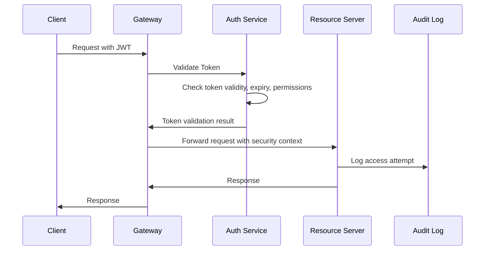

# Comprehensive Design Plan: Enhanced Inventory Management System

## Executive Summary

This document provides an in-depth architectural design plan for the Enhanced Inventory Management System, addressing security vulnerabilities, edge cases, and implementation best practices identified through analysis of the existing system and proposed features. The design follows industry standards for enterprise-grade SaaS applications with a focus on security, scalability, and reliability.

## Critical Issues Identified and Resolutions

### 1. Security Vulnerabilities

#### **Issue 1.1: Insufficient Token Management**

- **Current**: Basic AES-256 encryption for Shopify tokens
- **Risk**: Token exposure, inadequate key rotation, weak encryption implementation
- **Resolution**: Implement enterprise-grade secrets management with AWS Secrets Manager/HashiCorp Vault

#### **Issue 1.2: Missing Input Validation and SQL Injection Prevention**

- **Current**: Basic input validation mentioned
- **Risk**: SQL injection, XSS, data corruption
- **Resolution**: Comprehensive input sanitization framework with parameterized queries

#### **Issue 1.3: Inadequate API Security**

- **Current**: Basic JWT authentication
- **Risk**: Token hijacking, replay attacks, privilege escalation
- **Resolution**: Enhanced JWT implementation with refresh tokens, API Gateway, and OAuth 2.0

#### **Issue 1.4: Missing Data Loss Prevention**

- **Current**: Basic backups mentioned
- **Risk**: Data breaches, compliance violations
- **Resolution**: Comprehensive data classification and DLP implementation

### 2. Architectural Edge Cases

#### **Issue 2.1: Multi-Channel Conflict Resolution**

- **Current**: Basic conflict resolution mentioned
- **Risk**: Data inconsistency, overselling, lost sales
- **Resolution**: Event-sourcing architecture with CQRS pattern

#### **Issue 2.2: Scalability Bottlenecks**

- **Current**: Single database, basic caching
- **Risk**: Performance degradation under load
- **Resolution**: Microservices architecture with database sharding

#### **Issue 2.3: Third-Party API Failure Handling**

- **Current**: Basic retry mechanism
- **Risk**: System failure cascading from external dependencies
- **Resolution**: Circuit breaker pattern with graceful degradation

---

## Enhanced Security Architecture

### 1. Zero-Trust Security Model

#### **Identity and Access Management (IAM)**

```typescript
interface SecurityContext {
  userId: string;
  tenantId: string;
  roles: Role[];
  permissions: Permission[];
  sessionId: string;
  ipAddress: string;
  userAgent: string;
  mfaVerified: boolean;
  lastActivity: Date;
}

interface Role {
  id: string;
  name: string;
  permissions: Permission[];
  dataAccess: DataAccessPolicy[];
}

interface Permission {
  resource: string;
  actions: string[];
  conditions?: AccessCondition[];
}
```

#### **Multi-Factor Authentication (MFA)**

- **Primary**: Time-based OTP (TOTP) using industry-standard algorithms
- **Backup**: SMS with rate limiting and geo-verification
- **Enterprise**: Hardware security keys (FIDO2/WebAuthn)
- **Biometric**: Fingerprint/Face ID for mobile applications

#### **Token Management Strategy**

```typescript
interface TokenPair {
  accessToken: {
    value: string;
    expiresAt: Date;
    scopes: string[];
  };
  refreshToken: {
    value: string;
    expiresAt: Date;
    family: string; // Token rotation family
  };
}

interface EncryptedSecret {
  encryptedValue: string;
  keyId: string;
  algorithm: "AES-256-GCM";
  iv: string;
  tag: string;
  rotationSchedule: Date;
}
```

### 2. Data Protection Framework

#### **Encryption Standards**

- **At Rest**: AES-256-GCM with key rotation every 90 days
- **In Transit**: TLS 1.3 with perfect forward secrecy
- **Application Level**: Field-level encryption for PII and financial data
- **Key Management**: HSM-backed key storage with access logging

#### **Data Classification**

```typescript
enum DataClassification {
  PUBLIC = "public",
  INTERNAL = "internal",
  CONFIDENTIAL = "confidential",
  RESTRICTED = "restricted",
}

interface DataField {
  name: string;
  classification: DataClassification;
  encryptionRequired: boolean;
  maskingRules?: MaskingRule[];
  retentionPeriod: number; // days
  auditRequired: boolean;
}
```

#### **Privacy by Design Implementation**

- **Purpose Limitation**: Data collection limited to specific business purposes
- **Data Minimization**: Collect only necessary data for functionality
- **Consent Management**: Granular consent with easy withdrawal
- **Right to be Forgotten**: Automated data deletion workflows

### 3. API Security Framework

#### **Enhanced Authentication Flow**



#### **Rate Limiting Strategy**

```typescript
interface RateLimitConfig {
  globalLimit: {
    requests: number;
    windowMs: number;
  };
  userLimits: {
    authenticated: { requests: number; windowMs: number };
    premium: { requests: number; windowMs: number };
  };
  endpointLimits: Map<string, RateLimit>;
  ipWhitelist: string[];
  skipSuccessfulRequests: boolean;
}
```

---

## Scalable Architecture Design

### 1. Microservices Architecture

#### **Service Decomposition**

```typescript
interface ServiceRegistry {
  "user-service": {
    responsibilities: ["authentication", "user-management", "permissions"];
    database: "users-db";
    dependencies: ["notification-service"];
  };
  "inventory-service": {
    responsibilities: ["stock-tracking", "allocation", "adjustments"];
    database: "inventory-db";
    dependencies: ["channel-service", "forecast-service"];
  };
  "channel-service": {
    responsibilities: ["multi-channel-sync", "webhook-handling"];
    database: "channels-db";
    dependencies: ["inventory-service", "queue-service"];
  };
  "forecast-service": {
    responsibilities: ["demand-prediction", "analytics"];
    database: "analytics-db";
    dependencies: ["inventory-service"];
  };
  "notification-service": {
    responsibilities: ["alerts", "emails", "push-notifications"];
    database: "notifications-db";
    dependencies: [];
  };
}
```

#### **Inter-Service Communication**

- **Synchronous**: gRPC for low-latency service-to-service calls
- **Asynchronous**: Event-driven architecture with Apache Kafka
- **API Gateway**: Kong/AWS API Gateway for external API management
- **Service Mesh**: Istio for traffic management and security

### 2. Event-Driven Architecture

#### **Event Sourcing Implementation**

```typescript
interface DomainEvent {
  eventId: string;
  eventType: string;
  aggregateId: string;
  aggregateType: string;
  eventVersion: number;
  timestamp: Date;
  userId: string;
  metadata: Record<string, any>;
  payload: any;
}

interface EventStore {
  append(streamId: string, events: DomainEvent[]): Promise<void>;
  getEvents(streamId: string, fromVersion?: number): Promise<DomainEvent[]>;
  subscribe(eventType: string, handler: EventHandler): void;
}
```

#### **CQRS Pattern for Data Consistency**

```typescript
interface CommandHandler<T> {
  handle(command: T): Promise<void>;
}

interface QueryHandler<T, R> {
  handle(query: T): Promise<R>;
}

interface Projection {
  name: string;
  eventHandlers: Map<string, ProjectionHandler>;
  rebuild(): Promise<void>;
}
```

### 3. Database Design and Optimization

#### **Enhanced Schema with Audit and Versioning**

```sql
-- Enhanced Users table with audit trail
CREATE TABLE users (
  user_id UUID PRIMARY KEY DEFAULT gen_random_uuid(),
  email VARCHAR(255) UNIQUE NOT NULL,
  password_hash VARCHAR(255) NOT NULL,
  password_salt VARCHAR(255) NOT NULL,
  mfa_enabled BOOLEAN DEFAULT FALSE,
  mfa_secret VARCHAR(255),
  account_status user_status DEFAULT 'active',
  created_at TIMESTAMP WITH TIME ZONE DEFAULT NOW(),
  updated_at TIMESTAMP WITH TIME ZONE DEFAULT NOW(),
  last_login TIMESTAMP WITH TIME ZONE,
  failed_login_attempts INTEGER DEFAULT 0,
  account_locked_until TIMESTAMP WITH TIME ZONE,
  data_classification data_classification_enum DEFAULT 'confidential',
  CONSTRAINT password_complexity CHECK (char_length(password_hash) >= 60)
);

-- Audit table for compliance
CREATE TABLE audit_log (
  audit_id UUID PRIMARY KEY DEFAULT gen_random_uuid(),
  table_name VARCHAR(100) NOT NULL,
  operation VARCHAR(10) NOT NULL,
  row_id UUID NOT NULL,
  old_values JSONB,
  new_values JSONB,
  user_id UUID,
  ip_address INET,
  user_agent TEXT,
  timestamp TIMESTAMP WITH TIME ZONE DEFAULT NOW(),
  session_id UUID
);

-- Enhanced Inventory with versioning
CREATE TABLE inventory (
  inventory_id UUID PRIMARY KEY DEFAULT gen_random_uuid(),
  product_id UUID REFERENCES products(product_id) ON DELETE CASCADE,
  current_stock INTEGER NOT NULL CHECK (current_stock >= 0),
  reserved_stock INTEGER DEFAULT 0 CHECK (reserved_stock >= 0),
  available_stock INTEGER GENERATED ALWAYS AS (current_stock - reserved_stock) STORED,
  reorder_point INTEGER DEFAULT 0,
  max_stock_level INTEGER,
  last_updated TIMESTAMP WITH TIME ZONE DEFAULT NOW(),
  version INTEGER DEFAULT 1,
  location_id UUID REFERENCES locations(location_id),
  cost_per_unit DECIMAL(10,2),
  CONSTRAINT stock_consistency CHECK (reserved_stock <= current_stock)
);
```

#### **Performance Optimization**

```sql
-- Partitioning for large tables
CREATE TABLE sales (
  sale_id UUID DEFAULT gen_random_uuid(),
  product_id UUID NOT NULL,
  quantity_sold INTEGER NOT NULL,
  unit_price DECIMAL(10,2) NOT NULL,
  sale_date TIMESTAMP WITH TIME ZONE NOT NULL,
  channel_id UUID NOT NULL,
  PRIMARY KEY (sale_id, sale_date)
) PARTITION BY RANGE (sale_date);

-- Indexes for query optimization
CREATE INDEX CONCURRENTLY idx_sales_product_date ON sales (product_id, sale_date DESC);
CREATE INDEX CONCURRENTLY idx_inventory_product_location ON inventory (product_id, location_id);
CREATE INDEX CONCURRENTLY idx_audit_user_timestamp ON audit_log (user_id, timestamp DESC);

-- Materialized views for analytics
CREATE MATERIALIZED VIEW inventory_analytics AS
SELECT
  p.product_id,
  p.product_name,
  i.current_stock,
  i.reserved_stock,
  i.available_stock,
  COALESCE(s.avg_daily_sales, 0) as avg_daily_sales,
  CASE
    WHEN COALESCE(s.avg_daily_sales, 0) > 0
    THEN i.available_stock / s.avg_daily_sales
    ELSE NULL
  END as days_of_supply
FROM products p
LEFT JOIN inventory i ON p.product_id = i.product_id
LEFT JOIN (
  SELECT
    product_id,
    AVG(daily_sales) as avg_daily_sales
  FROM (
    SELECT
      product_id,
      DATE(sale_date) as sale_day,
      SUM(quantity_sold) as daily_sales
    FROM sales
    WHERE sale_date >= NOW() - INTERVAL '90 days'
    GROUP BY product_id, DATE(sale_date)
  ) daily_summary
  GROUP BY product_id
) s ON p.product_id = s.product_id;
```

---

## Multi-Channel Integration Framework

### 1. Channel Abstraction Layer

#### **Universal Channel Interface**

```typescript
interface ChannelConnector {
  readonly channelType: ChannelType;
  readonly capabilities: ChannelCapability[];

  authenticate(credentials: ChannelCredentials): Promise<AuthResult>;
  syncInventory(request: InventorySyncRequest): Promise<SyncResult>;
  processWebhook(payload: WebhookPayload): Promise<ProcessResult>;
  getOrders(filter: OrderFilter): Promise<Order[]>;
  updateInventory(updates: InventoryUpdate[]): Promise<UpdateResult>;

  // Health check and monitoring
  healthCheck(): Promise<HealthStatus>;
  getRateLimits(): RateLimitInfo;
}

enum ChannelType {
  SHOPIFY = "shopify",
  AMAZON = "amazon",
  EBAY = "ebay",
  SQUARE = "square",
  CUSTOM_API = "custom_api",
}

interface ChannelCapability {
  name: string;
  supported: boolean;
  limitations?: string[];
}
```

#### **Conflict Resolution Engine**

```typescript
interface ConflictResolutionStrategy {
  priority: number;
  conditions: ConflictCondition[];
  resolution: ResolutionAction;
}

interface InventoryConflict {
  conflictId: string;
  productId: string;
  channels: ChannelInventoryState[];
  detectedAt: Date;
  conflictType: ConflictType;
  severity: ConflictSeverity;
}

enum ConflictType {
  OVERSOLD = "oversold",
  STOCK_MISMATCH = "stock_mismatch",
  PRICING_DISCREPANCY = "pricing_discrepancy",
  DUPLICATE_SALE = "duplicate_sale",
}

class ConflictResolver {
  async resolveConflict(
    conflict: InventoryConflict
  ): Promise<ResolutionResult> {
    const strategy = await this.selectStrategy(conflict);
    const resolution = await this.applyStrategy(strategy, conflict);
    await this.auditResolution(conflict, resolution);
    return resolution;
  }
}
```

### 2. Real-Time Synchronization

#### **Event-Driven Inventory Updates**

```typescript
interface InventoryEvent {
  eventId: string;
  productId: string;
  locationId?: string;
  changeType: InventoryChangeType;
  previousQuantity: number;
  newQuantity: number;
  channelId: string;
  timestamp: Date;
  causedBy: {
    userId?: string;
    orderId?: string;
    adjustmentId?: string;
  };
}

class InventoryEventProcessor {
  async processEvent(event: InventoryEvent): Promise<void> {
    // Validate event
    await this.validateEvent(event);

    // Apply business rules
    const enrichedEvent = await this.applyBusinessRules(event);

    // Update inventory
    await this.updateInventory(enrichedEvent);

    // Propagate to channels
    await this.propagateToChannels(enrichedEvent);

    // Trigger alerts if needed
    await this.checkAlertConditions(enrichedEvent);
  }
}
```

#### **Webhook Management System**

```typescript
interface WebhookManager {
  registerWebhook(config: WebhookConfig): Promise<string>;
  processWebhook(payload: WebhookPayload): Promise<void>;
  validateSignature(
    payload: string,
    signature: string,
    secret: string
  ): boolean;
  retryFailedWebhook(webhookId: string): Promise<void>;
}

interface WebhookConfig {
  channelType: ChannelType;
  eventTypes: string[];
  endpoint: string;
  secret: string;
  retryPolicy: RetryPolicy;
  filterCriteria?: FilterCriteria;
}
```

---

## Advanced Forecasting and Analytics

### 1. Enhanced ML Pipeline

#### **Multi-Model Forecasting Architecture**

```python
class ForecastingPipeline:
    def __init__(self):
        self.models = {
            'prophet': ProphetModel(),
            'arima': ARIMAModel(),
            'lstm': LSTMModel(),
            'ensemble': EnsembleModel()
        }

    async def generate_forecast(self, product_id: str, horizon: int) -> ForecastResult:
        # Data preparation
        data = await self.prepare_data(product_id)

        # Model selection based on data characteristics
        selected_models = self.select_models(data)

        # Generate predictions
        predictions = {}
        for model_name in selected_models:
            predictions[model_name] = await self.models[model_name].predict(data, horizon)

        # Ensemble combination
        final_forecast = self.combine_predictions(predictions)

        # Confidence intervals
        confidence_intervals = self.calculate_confidence_intervals(predictions)

        return ForecastResult(
            product_id=product_id,
            predictions=final_forecast,
            confidence_intervals=confidence_intervals,
            model_performance=await self.get_model_performance(product_id),
            data_quality_score=self.assess_data_quality(data)
        )
```

#### **Real-Time Model Performance Monitoring**

```typescript
interface ModelPerformanceTracker {
  trackPrediction(prediction: Prediction): Promise<void>;
  calculateAccuracy(
    productId: string,
    timeWindow: TimeWindow
  ): Promise<AccuracyMetrics>;
  detectModelDrift(modelId: string): Promise<DriftDetectionResult>;
  triggerRetraining(modelId: string, reason: string): Promise<void>;
}

interface AccuracyMetrics {
  mape: number; // Mean Absolute Percentage Error
  rmse: number; // Root Mean Square Error
  mae: number; // Mean Absolute Error
  bias: number;
  confidenceIntervalCoverage: number;
}
```

### 2. Advanced Analytics Engine

#### **Real-Time Analytics Processing**

```typescript
interface AnalyticsProcessor {
  processStreamingData(stream: InventoryDataStream): Promise<void>;
  calculateKPIs(request: KPIRequest): Promise<KPIResult>;
  generateInsights(data: AnalyticsData): Promise<Insight[]>;
  detectAnomalies(timeSeries: TimeSeries): Promise<Anomaly[]>;
}

interface KPICalculator {
  calculateInventoryTurnover(
    productId: string,
    period: TimePeriod
  ): Promise<number>;
  calculateStockoutRate(
    filter: ProductFilter,
    period: TimePeriod
  ): Promise<number>;
  calculateCarryingCosts(productId: string): Promise<CarryingCostBreakdown>;
  calculateGrossMargin(
    productId: string,
    period: TimePeriod
  ): Promise<MarginAnalysis>;
}
```

---

## Security Compliance Framework

### 1. Regulatory Compliance

#### **GDPR Compliance Implementation**

```typescript
interface GDPRCompliance {
  processDataSubjectRequest(
    request: DataSubjectRequest
  ): Promise<ComplianceResult>;
  anonymizePersonalData(userId: string): Promise<void>;
  generateDataPortabilityReport(userId: string): Promise<PersonalDataReport>;
  maintainConsentRecords(userId: string, consent: ConsentRecord): Promise<void>;
}

interface ConsentRecord {
  userId: string;
  consentType: ConsentType;
  granted: boolean;
  timestamp: Date;
  ipAddress: string;
  consentMethod: string;
  withdrawalDate?: Date;
}
```

#### **SOC 2 Type II Preparation**

```typescript
interface SOC2Controls {
  // Security
  implementAccessControls(): Promise<void>;
  configureNetworkSecurity(): Promise<void>;
  setupSecurityMonitoring(): Promise<void>;

  // Availability
  implementHighAvailability(): Promise<void>;
  setupDisasterRecovery(): Promise<void>;

  // Processing Integrity
  implementDataValidation(): Promise<void>;
  setupErrorHandling(): Promise<void>;

  // Confidentiality
  implementDataClassification(): Promise<void>;
  setupDataLossPrevention(): Promise<void>;

  // Privacy
  implementPrivacyControls(): Promise<void>;
  setupDataMinimization(): Promise<void>;
}
```

### 2. Security Monitoring and Incident Response

#### **Security Information and Event Management (SIEM)**

```typescript
interface SecurityEvent {
  eventId: string;
  eventType: SecurityEventType;
  severity: SecuritySeverity;
  timestamp: Date;
  sourceIp: string;
  userId?: string;
  resourceAccessed: string;
  action: string;
  outcome: string;
  additionalContext: Record<string, any>;
}

class SecurityMonitor {
  async detectAnomalies(events: SecurityEvent[]): Promise<SecurityThreat[]> {
    const threats = [];

    // Detect unusual access patterns
    threats.push(...(await this.detectUnusualAccess(events)));

    // Detect potential data exfiltration
    threats.push(...(await this.detectDataExfiltration(events)));

    // Detect brute force attacks
    threats.push(...(await this.detectBruteForce(events)));

    // Detect privilege escalation
    threats.push(...(await this.detectPrivilegeEscalation(events)));

    return threats;
  }
}
```

#### **Incident Response Automation**

```typescript
interface IncidentResponse {
  classifyIncident(incident: SecurityIncident): Promise<IncidentClassification>;
  containThreat(threat: SecurityThreat): Promise<ContainmentResult>;
  notifyStakeholders(incident: SecurityIncident): Promise<void>;
  generateForensicReport(incidentId: string): Promise<ForensicReport>;
}

enum IncidentSeverity {
  LOW = "low",
  MEDIUM = "medium",
  HIGH = "high",
  CRITICAL = "critical",
}
```

---

## Performance and Scalability

### 1. Caching Strategy

#### **Multi-Layer Caching Architecture**

```typescript
interface CacheStrategy {
  // Application-level caching
  applicationCache: {
    type: "redis-cluster";
    ttl: number;
    evictionPolicy: "lru";
  };

  // Database query caching
  queryCache: {
    type: "redis";
    ttl: number;
    invalidationStrategy: "tag-based";
  };

  // CDN for static assets
  cdnCache: {
    provider: "cloudflare";
    ttl: number;
    compressionEnabled: boolean;
  };

  // Browser caching
  browserCache: {
    staticAssets: number;
    apiResponses: number;
  };
}

class CacheManager {
  async invalidateCache(tags: string[]): Promise<void>;
  async warmupCache(keys: string[]): Promise<void>;
  async getCacheStats(): Promise<CacheStatistics>;
}
```

### 2. Database Optimization

#### **Query Optimization and Monitoring**

```sql
-- Performance monitoring views
CREATE VIEW slow_queries AS
SELECT
  query,
  calls,
  total_time,
  mean_time,
  stddev_time,
  rows,
  100.0 * shared_blks_hit / nullif(shared_blks_hit + shared_blks_read, 0) AS hit_percent
FROM pg_stat_statements
WHERE mean_time > 100  -- queries taking more than 100ms on average
ORDER BY total_time DESC;

-- Automated index recommendations
CREATE OR REPLACE FUNCTION recommend_indexes()
RETURNS TABLE(
  table_name text,
  column_names text,
  query_benefit numeric
) AS $$
BEGIN
  -- Implementation of index recommendation logic
  RETURN QUERY
  SELECT
    schemaname || '.' || tablename as table_name,
    attname as column_names,
    n_distinct::numeric as query_benefit
  FROM pg_stats
  WHERE n_distinct > 100
  AND correlation < 0.1
  ORDER BY n_distinct DESC;
END;
$$ LANGUAGE plpgsql;
```

### 3. Auto-Scaling Configuration

#### **Kubernetes-Based Auto-Scaling**

```yaml
apiVersion: autoscaling/v2
kind: HorizontalPodAutoscaler
metadata:
  name: inventory-service-hpa
spec:
  scaleTargetRef:
    apiVersion: apps/v1
    kind: Deployment
    name: inventory-service
  minReplicas: 2
  maxReplicas: 20
  metrics:
    - type: Resource
      resource:
        name: cpu
        target:
          type: Utilization
          averageUtilization: 70
    - type: Resource
      resource:
        name: memory
        target:
          type: Utilization
          averageUtilization: 80
    - type: Pods
      pods:
        metric:
          name: http_requests_per_second
        target:
          type: AverageValue
          averageValue: "100"
```

---

## Testing and Quality Assurance

### 1. Comprehensive Testing Strategy

#### **Security Testing Framework**

```typescript
interface SecurityTestSuite {
  authenticationTests(): Promise<TestResult[]>;
  authorizationTests(): Promise<TestResult[]>;
  inputValidationTests(): Promise<TestResult[]>;
  sqlInjectionTests(): Promise<TestResult[]>;
  xssPreventionTests(): Promise<TestResult[]>;
  csrfProtectionTests(): Promise<TestResult[]>;
  rateLimitingTests(): Promise<TestResult[]>;
}

class SecurityTester {
  async runPenetrationTests(): Promise<PenTestReport> {
    return {
      vulnerabilities: await this.scanForVulnerabilities(),
      authenticationWeaknesses: await this.testAuthentication(),
      authorizationFlaws: await this.testAuthorization(),
      dataExposureRisks: await this.testDataExposure(),
      recommendations: await this.generateRecommendations(),
    };
  }
}
```

#### **Performance Testing**

```typescript
interface LoadTestScenario {
  name: string;
  duration: number;
  virtualUsers: number;
  rampUpTime: number;
  testSteps: TestStep[];
  acceptanceCriteria: PerformanceCriteria;
}

interface PerformanceCriteria {
  maxResponseTime: number;
  maxErrorRate: number;
  minThroughput: number;
  maxResourceUtilization: ResourceLimits;
}
```

### 2. Chaos Engineering

#### **Resilience Testing**

```typescript
class ChaosEngineer {
  async injectLatency(service: string, latency: number): Promise<void>;
  async injectFailure(service: string, failureRate: number): Promise<void>;
  async partitionNetwork(services: string[]): Promise<void>;
  async resourceExhaustion(resource: ResourceType): Promise<void>;

  async measureRecoveryTime(
    experiment: ChaosExperiment
  ): Promise<RecoveryMetrics>;
}

interface ChaosExperiment {
  name: string;
  hypothesis: string;
  steadyStateHypothesis: SteadyStateHypothesis;
  method: ExperimentMethod;
  rollbacks: RollbackStep[];
}
```

---

## Deployment and Operations

### 1. Infrastructure as Code

#### **Terraform Configuration**

```hcl
# main.tf
module "inventory_system" {
  source = "./modules/inventory-system"

  environment = var.environment

  # Database configuration
  database_instance_class = var.database_instance_class
  database_allocated_storage = var.database_allocated_storage
  database_backup_retention_period = 30

  # Redis configuration
  redis_node_type = var.redis_node_type
  redis_num_cache_nodes = var.redis_num_cache_nodes

  # Auto-scaling configuration
  min_capacity = 2
  max_capacity = 20
  target_cpu_utilization = 70

  # Security configuration
  enable_encryption_at_rest = true
  enable_encryption_in_transit = true
  enable_vpc_flow_logs = true

  tags = {
    Environment = var.environment
    Project = "inventory-management"
    ManagedBy = "terraform"
  }
}
```

### 2. Monitoring and Observability

#### **Comprehensive Monitoring Stack**

```typescript
interface MonitoringConfiguration {
  metrics: {
    prometheus: PrometheusConfig;
    cloudwatch: CloudWatchConfig;
    customMetrics: CustomMetricConfig[];
  };

  logging: {
    elasticsearch: ElasticsearchConfig;
    cloudwatchLogs: CloudWatchLogsConfig;
    structuredLogging: boolean;
  };

  tracing: {
    jaeger: JaegerConfig;
    xray: XRayConfig;
    samplingRate: number;
  };

  alerting: {
    pagerduty: PagerDutyConfig;
    slack: SlackConfig;
    email: EmailConfig;
    escalationPolicy: EscalationPolicy;
  };
}
```

#### **Custom Metrics and Dashboards**

```typescript
interface BusinessMetrics {
  inventoryTurnoverRate: MetricDefinition;
  stockoutRate: MetricDefinition;
  forecastAccuracy: MetricDefinition;
  syncLatency: MetricDefinition;
  userSatisfactionScore: MetricDefinition;
}

interface TechnicalMetrics {
  apiResponseTime: MetricDefinition;
  errorRate: MetricDefinition;
  throughput: MetricDefinition;
  databaseConnections: MetricDefinition;
  cacheHitRate: MetricDefinition;
}
```

---

## Implementation Roadmap and Risk Mitigation

### 1. Phased Implementation Strategy

#### **Phase 1: Security Foundation (Weeks 1-2)**

- Implement enhanced authentication and authorization
- Set up secrets management and encryption
- Establish audit logging and monitoring
- Configure security scanning and testing

#### **Phase 2: Core Architecture (Weeks 3-4)**

- Migrate to microservices architecture
- Implement event-driven communication
- Set up database optimization and monitoring
- Deploy caching infrastructure

#### **Phase 3: Advanced Features (Weeks 5-6)**

- Implement multi-channel synchronization
- Deploy enhanced forecasting capabilities
- Set up real-time analytics processing
- Configure automated scaling

#### **Phase 4: Compliance and Operations (Weeks 7-8)**

- Complete compliance frameworks (GDPR, SOC 2)
- Implement comprehensive monitoring
- Set up disaster recovery procedures
- Conduct security audits and penetration testing

### 2. Risk Assessment and Mitigation

#### **Technical Risks**

```typescript
interface RiskAssessment {
  risks: {
    dataLoss: {
      probability: "low";
      impact: "high";
      mitigation: "Automated backups, replication, point-in-time recovery";
    };
    securityBreach: {
      probability: "medium";
      impact: "high";
      mitigation: "Defense in depth, regular audits, incident response plan";
    };
    performanceDegradation: {
      probability: "medium";
      impact: "medium";
      mitigation: "Auto-scaling, caching, performance monitoring";
    };
    thirdPartyFailure: {
      probability: "high";
      impact: "medium";
      mitigation: "Circuit breakers, fallback mechanisms, vendor diversification";
    };
  };
}
```

#### **Business Continuity Plan**

```typescript
interface BusinessContinuityPlan {
  disasterRecovery: {
    rto: number; // Recovery Time Objective: 4 hours
    rpo: number; // Recovery Point Objective: 1 hour
    backupStrategy: "continuous-replication";
    testFrequency: "quarterly";
  };

  incidentResponse: {
    escalationMatrix: EscalationMatrix;
    communicationPlan: CommunicationPlan;
    recoveryProcedures: RecoveryProcedure[];
  };

  vendorManagement: {
    slaRequirements: SLARequirement[];
    fallbackProviders: Provider[];
    contractTerms: ContractTerm[];
  };
}
```

---

## Conclusion

This comprehensive design plan addresses critical security vulnerabilities, architectural limitations, and scalability concerns identified in the original design. The enhanced architecture follows industry best practices for enterprise-grade SaaS applications, ensuring security, compliance, performance, and reliability.

Key improvements include:

1. **Zero-trust security model** with comprehensive authentication and authorization
2. **Event-driven microservices architecture** for scalability and resilience
3. **Advanced ML pipeline** with multiple forecasting models and real-time monitoring
4. **Comprehensive compliance framework** for GDPR and SOC 2
5. **Robust monitoring and observability** for proactive issue detection
6. **Automated testing and quality assurance** including security and chaos engineering

The implementation follows a phased approach to minimize risk while delivering value incrementally. Each phase builds upon the previous one, ensuring a solid foundation before adding advanced features.

This design serves as a reference for LLM-assisted development of individual tickets, providing detailed specifications, security considerations, and implementation guidance for each component of the enhanced inventory management system.
