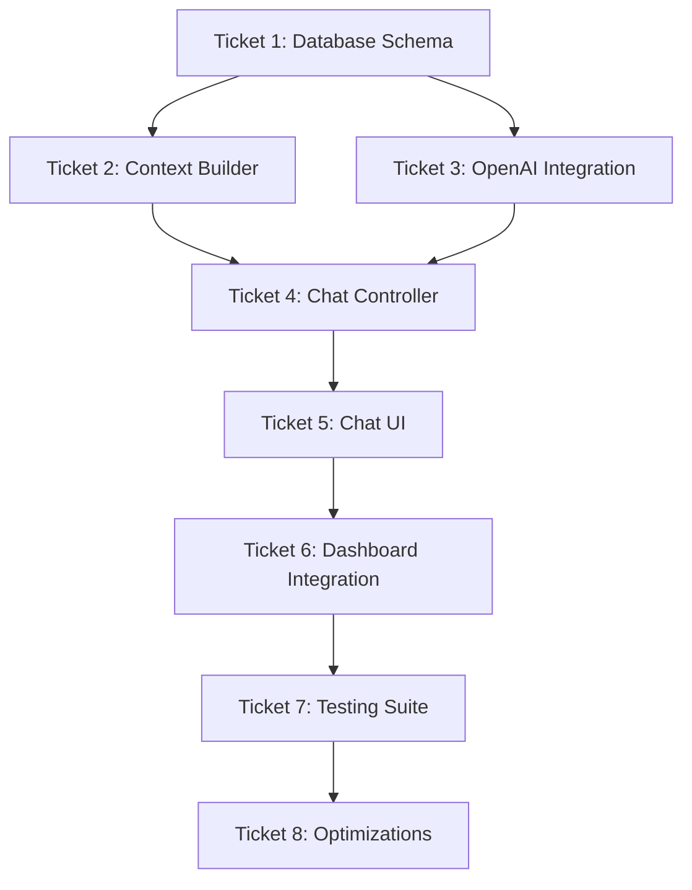

# AI Chatbot Implementation Tickets

## Overview
This document contains detailed implementation tickets for integrating an AI-powered chatbot into the Fluxor inventory management system. Each ticket is designed to be self-contained and can be assigned to an AI agent for implementation.

---

## Ticket 1: Database Schema & Infrastructure Setup

**Priority:** High  
**Dependencies:** None  
**Estimated Effort:** 2-3 hours

### Description
Create the database schema and infrastructure necessary to support the AI chatbot functionality. This includes tables for storing conversations, messages, and analytics.

### Technical Requirements
1. Create PostgreSQL migration scripts for new tables:
   - `chat_conversations` - Store conversation metadata
   - `chat_messages` - Store individual messages
   - `chat_analytics` - Track usage and performance metrics
   
2. Implement proper indexes for performance optimization

3. Set up Redis configuration for caching chat contexts

### Implementation Details
- Reference: `/specs/chatbot_technical_implementation.md` lines 54-95
- Follow existing migration patterns in `/backend/src/migrations/`
- Ensure foreign key constraints to users and stores tables
- Include audit fields (created_at, updated_at)
- Add soft delete capability for conversations

### Acceptance Criteria
- [ ] Migration scripts created and tested
- [ ] All tables have proper indexes
- [ ] Foreign key relationships established
- [ ] Migration can be rolled back cleanly
- [ ] Unit tests for database operations

### Testing Requirements
```javascript
// Test migration up and down
describe('Chat Database Migration', () => {
  it('should create all required tables', async () => {
    // Test table creation
  });
  
  it('should create proper indexes', async () => {
    // Verify indexes exist
  });
  
  it('should handle rollback correctly', async () => {
    // Test migration rollback
  });
});
```

---

## Ticket 2: Backend Services - Context Builder & Data Aggregation

**Priority:** High  
**Dependencies:** Ticket 1  
**Estimated Effort:** 4-5 hours

### Description
Implement the ChatContextBuilder service that aggregates data from various sources (inventory, forecasts, events) to provide context for AI responses.

### Technical Requirements
1. Create `chatContextBuilder.ts` service in `/backend/src/services/`
2. Implement methods for:
   - Building comprehensive chat context
   - Parallel data fetching from multiple services
   - Filtering relevant data based on user queries
   - Keyword extraction from messages

### Implementation Details
- Reference: `/specs/chatbot_technical_implementation.md` lines 98-226
- Integrate with existing services:
  - InventoryService
  - ForecastService (Prophet integration)
  - BusinessEventService
- Implement efficient data filtering
- Add caching layer with Redis

### Acceptance Criteria
- [ ] Context builder aggregates data from all required sources
- [ ] Parallel data fetching implemented
- [ ] Keyword extraction working correctly
- [ ] Redis caching implemented
- [ ] Error handling for service failures
- [ ] Performance under 500ms for context building

### Testing Requirements
```javascript
describe('ChatContextBuilder', () => {
  it('should aggregate data from multiple sources', async () => {
    // Mock services and test aggregation
  });
  
  it('should filter data based on keywords', async () => {
    // Test keyword-based filtering
  });
  
  it('should handle service failures gracefully', async () => {
    // Test error scenarios
  });
  
  it('should use cache when available', async () => {
    // Test Redis caching
  });
});
```

---

## Ticket 3: Backend Services - Prompt Engineering & OpenAI Integration

**Priority:** High  
**Dependencies:** Ticket 2  
**Estimated Effort:** 4-5 hours

### Description
Implement the prompt engineering service and OpenAI integration for generating AI responses.

### Technical Requirements
1. Create `promptEngineering.ts` service
2. Create `openaiService.ts` for API integration
3. Implement:
   - Intent classification system
   - Template-based prompt generation
   - OpenAI API integration with GPT-3.5-turbo
   - Rate limiting and token management
   - Response confidence scoring

### Implementation Details
- Reference: `/specs/chatbot_technical_implementation.md` lines 228-666
- Create prompt templates for different intent categories
- Implement rate limiting per user
- Add retry logic for API failures
- Calculate response confidence scores

### Security Requirements
- Store OpenAI API key in environment variables
- Implement request sanitization
- Add rate limiting to prevent abuse
- Monitor token usage for cost control

### Acceptance Criteria
- [ ] All intent categories have templates
- [ ] OpenAI integration working with error handling
- [ ] Rate limiting enforced per user
- [ ] Token usage tracked accurately
- [ ] Confidence scoring implemented
- [ ] Fallback responses for API failures

### Testing Requirements
```javascript
describe('PromptEngineeringService', () => {
  it('should classify intents correctly', () => {
    // Test intent classification
  });
  
  it('should generate appropriate prompts', () => {
    // Test prompt generation for each template
  });
});

describe('OpenAIService', () => {
  it('should handle API responses', async () => {
    // Mock OpenAI API and test
  });
  
  it('should enforce rate limits', async () => {
    // Test rate limiting
  });
  
  it('should provide fallback on failure', async () => {
    // Test error scenarios
  });
});
```

---

## Ticket 4: Backend Services - Chat Controller & API Routes

**Priority:** High  
**Dependencies:** Tickets 2, 3  
**Estimated Effort:** 3-4 hours

### Description
Implement the chat controller and API routes for handling chat interactions.

### Technical Requirements
1. Create `chatController.ts` in `/backend/src/controllers/`
2. Create `chatRoutes.ts` in `/backend/src/routes/`
3. Create `chatHistoryService.ts` for conversation management
4. Implement endpoints:
   - POST `/api/v1/chat/message` - Send message
   - POST `/api/v1/chat/stream` - Stream responses
   - GET `/api/v1/chat/conversation/:id` - Get history
   - GET `/api/v1/chat/conversations` - List conversations
   - DELETE `/api/v1/chat/conversation/:id` - Delete conversation

### Implementation Details
- Reference: `/specs/chatbot_technical_implementation.md` lines 669-1219
- Implement Server-Sent Events for streaming
- Add request validation middleware
- Integrate with authentication middleware
- Handle conversation context management

### Acceptance Criteria
- [ ] All endpoints implemented and documented
- [ ] Authentication required for all routes
- [ ] Input validation working
- [ ] SSE streaming functional
- [ ] Conversation history stored correctly
- [ ] Error responses follow API standards

### Testing Requirements
```javascript
describe('Chat API Routes', () => {
  it('should send messages successfully', async () => {
    // Test message endpoint
  });
  
  it('should stream responses via SSE', async () => {
    // Test streaming endpoint
  });
  
  it('should retrieve conversation history', async () => {
    // Test history endpoint
  });
  
  it('should enforce authentication', async () => {
    // Test auth requirements
  });
});
```

---

## Ticket 5: Frontend Components - Chat UI Foundation (Parent Ticket)

**Priority:** High  
**Dependencies:** Ticket 4  
**Total Estimated Effort:** 5-6 hours

### Description
Implement the core chat UI components using React and shadcn/ui, following the existing dark theme design system. This parent ticket has been broken down into smaller sub-tickets for better task management.

### Sub-Tickets

---

## Ticket 5.1: Chat Trigger Component

**Priority:** High  
**Dependencies:** None  
**Estimated Effort:** 0.5 hours

### Description
Create the floating action button (FAB) that triggers the chat panel.

### Technical Requirements
1. Create `ChatTrigger.tsx` in `/components/chat/`
2. Implement:
   - Floating action button with chat icon
   - Fixed position (bottom-right corner)
   - Keyboard shortcut support (Ctrl+K)
   - Hover and active states
   - Click handler to open chat panel

### Implementation Details
- Use shadcn/ui Button component
- Position: `fixed bottom-6 right-6`
- Blue accent color (#3b82f6)
- Shadow for elevation
- Smooth hover transitions

### Acceptance Criteria
- [x] FAB renders in correct position
- [x] Keyboard shortcut (Ctrl+K) works
- [x] Hover states display correctly
- [x] Click opens chat panel
- [x] Accessible with proper ARIA labels

### Implementation Status
**Completed** - The ChatTrigger component has been successfully implemented with all required features:
- Created `/components/chat/ChatTrigger.tsx`
- Floating action button positioned at `fixed bottom-6 right-6`
- Blue accent color (#3b82f6) with hover states
- Keyboard shortcut support (Ctrl+K / Cmd+K)
- ARIA labels and title for accessibility
- Smooth scale animation on hover
- Demo page created at `/app/chat-demo/page.tsx` for testing

---

## Ticket 5.2: Chat Panel Component

**Priority:** High  
**Dependencies:** Ticket 5.1  
**Estimated Effort:** 1 hour

### Description
Create the main chat interface panel that slides in from the right.

### Technical Requirements
1. Create `ChatPanel.tsx` in `/components/chat/`
2. Implement:
   - Slide-in animation from right
   - Header with title and close button
   - Container for conversation view
   - Footer for input area
   - Backdrop for mobile

### Implementation Details
- Use shadcn/ui Sheet component
- Dark theme background (#1f2937)
- Smooth slide animations
- Responsive sizing (full screen mobile, 400px desktop)
- Z-index management

### Acceptance Criteria
- [x] Panel slides in smoothly
- [x] Close button functional
- [x] Responsive on all devices
- [x] Dark theme applied correctly
- [x] Backdrop works on mobile

### Implementation Status
**Completed** - The ChatPanel component has been successfully implemented with all required features:
- Created `/components/chat/ChatPanel.tsx`
- Uses shadcn/ui Sheet component for slide-in functionality
- Dark theme background (#1f2937) with gray-900 styling
- Header includes AI Assistant title with Bot icon
- ScrollArea for conversation content with proper overflow handling
- Footer section reserved for input components
- Responsive width (full screen mobile, 400px desktop)
- Backdrop overlay with proper z-index management
- Demo page updated to showcase integration with ChatTrigger

---

## Ticket 5.3: Message Components

**Priority:** High  
**Dependencies:** Ticket 5.2  
**Estimated Effort:** 1 hour

### Description
Create message display components for user and assistant messages.

### Technical Requirements
1. Create `MessageBubble.tsx` in `/components/chat/`
2. Create `ConversationView.tsx` in `/components/chat/`
3. Implement:
   - Different styles for user/assistant messages
   - Message timestamps
   - Scrollable conversation container
   - Auto-scroll to latest message
   - Message animations

### Implementation Details
- User messages: Right-aligned, gray background
- Assistant messages: Left-aligned, blue accent
- Time stamps in subtle text
- Smooth scroll behavior
- Virtual scrolling for performance

### Acceptance Criteria
- [x] Messages display correctly
- [x] Visual distinction between user/assistant
- [x] Timestamps visible
- [x] Smooth scrolling works
- [x] Long conversations perform well

### Implementation Status
**Completed** - The Message Components have been successfully implemented with all required features:
- Created `/components/chat/MessageBubble.tsx` with:
  - Different styles for user (right-aligned, gray) and assistant (left-aligned, blue accent)
  - Avatar icons (User icon for users, Bot icon for assistant)
  - Timestamp formatting using Intl.DateTimeFormat
  - Animated typing indicator with bouncing dots
  - Smooth fade-in and slide-up animations
- Created `/components/chat/ConversationView.tsx` with:
  - ScrollArea container for message list
  - Auto-scroll to latest message on new messages or typing
  - Welcome message when conversation is empty
  - Support for typing indicator
  - Proper message rendering with unique IDs
- Updated chat demo page to showcase all message features:
  - Demo conversation with multiple messages
  - Interactive typing simulation
  - Proper integration with ChatPanel component
- All components use dark theme consistent with the application design

---

## Ticket 5.4: Input Components

**Priority:** High  
**Dependencies:** Ticket 5.3  
**Estimated Effort:** 0.5 hours

### Description
Create the message input area and typing indicator.

### Technical Requirements
1. Create `ChatInput.tsx` in `/components/chat/`
2. Create `TypingIndicator.tsx` in `/components/chat/`
3. Implement:
   - Text input with send button
   - Character limit indicator
   - Typing indicator animation
   - Enter to send support
   - Input validation

### Implementation Details
- Use shadcn/ui Input and Button components
- 1000 character limit
- Three-dot typing animation
- Disabled state while sending
- Clear input after send

### Acceptance Criteria
- [x] Input accepts text properly
- [x] Send button works
- [x] Enter key sends message
- [x] Character limit enforced
- [x] Typing indicator animates

### Implementation Status
**Completed** - The Input Components have been successfully implemented with all required features:
- Created `/components/chat/ChatInput.tsx` with:
  - Text input using shadcn/ui Input component
  - Send button with Send icon
  - 1000 character limit with real-time counter
  - Character count warning when < 100 characters remaining
  - Enter key support for sending messages
  - Disabled state while sending
  - Clear input after send
  - Proper ARIA labels for accessibility
- Created `/components/chat/TypingIndicator.tsx` with:
  - Three-dot bouncing animation
  - Configurable label text
  - Reusable component that can be used standalone
- Updated ChatPanel component to:
  - Accept inputComponent prop
  - Render input component in footer area
- Updated demo page to showcase all input features:
  - Integrated ChatInput with message sending
  - Simulated AI responses with typing indicator
  - Disabled state during message processing
  - Full working example with character limits

---

## Ticket 5.5: State Management Hook

**Priority:** High  
**Dependencies:** Tickets 5.1-5.4  
**Estimated Effort:** 1.5 hours

### Description
Create the useChat hook for managing chat state and API integration.

### Technical Requirements
1. Create `useChat.tsx` in `/hooks/`
2. Implement:
   - Panel open/close state
   - Message history management
   - API integration for sending messages
   - Loading and error states
   - Conversation management
   - SSE support for streaming

### Implementation Details
- Use React hooks (useState, useEffect)
- Fetch API for HTTP requests
- EventSource for SSE
- Error boundary integration
- Local storage for persistence

### Acceptance Criteria
- [x] State management works correctly
- [x] API calls successful
- [x] Error handling implemented
- [x] Loading states display
- [x] SSE streaming functional

### Implementation Status
**Completed** - The useChat hook has been successfully implemented with all required features:
- Created `/hooks/useChat.tsx` with comprehensive state management:
  - Panel open/close state with toggle functionality
  - Message history management with proper typing
  - Conversation list and current conversation tracking
  - Loading and error states for better UX
- API integration implemented:
  - Standard POST endpoint for sending messages
  - SSE streaming support with EventSource for real-time responses
  - Conversation history loading
  - Conversation list fetching
  - Delete conversation functionality
- Advanced features:
  - Local storage persistence for conversations
  - Automatic conversation list refresh after sending messages
  - Proper cleanup for SSE connections and abort controllers
  - Error handling with user-friendly messages
  - Rate limit error detection
- Type-safe interfaces for all data structures

---

## Ticket 5.6: Responsive Design & Accessibility

**Priority:** Medium  
**Dependencies:** Tickets 5.1-5.5  
**Estimated Effort:** 1 hour

### Description
Implement responsive design and accessibility features across all chat components.

### Technical Requirements
1. Responsive breakpoints:
   - Mobile: Full screen overlay
   - Tablet: 450px width panel
   - Desktop: 400px width panel
2. Accessibility:
   - ARIA labels and roles
   - Keyboard navigation
   - Focus management
   - Screen reader support

### Implementation Details
- Use Tailwind responsive utilities
- Test with keyboard only
- Add proper ARIA attributes
- Manage focus trap in panel
- Test with screen readers

### Acceptance Criteria
- [x] Responsive on all screen sizes
- [x] Keyboard navigation complete
- [x] ARIA labels present
- [x] Focus management works
- [x] Screen reader compatible

### Implementation Status
**Completed** - Responsive design and accessibility features have been successfully implemented:
- Responsive Design Enhancements:
  - ChatPanel: Full width on mobile, 400px on small screens, 450px on medium+ screens
  - Message bubbles: Responsive padding and max-width (85% mobile, 80% desktop)
  - Welcome message: Responsive sizing for icon and text
  - Input area: Responsive padding in footer
  - Consistent use of Tailwind responsive utilities (sm:, md:)
- Accessibility Features:
  - ARIA labels and roles throughout all components
  - ChatPanel: aria-label, role="log" for messages with aria-live="polite"
  - MessageBubble: role="article", proper time element, aria-hidden for decorative icons
  - ChatInput: aria-live regions for character count, role="alert" for warnings
  - TypingIndicator: role="status" with screen reader text
  - ConversationView: Proper heading hierarchy and decorative icon handling
- Keyboard Navigation:
  - Created useFocusTrap hook for proper focus management in panel
  - Escape key support to close panel
  - Tab navigation cycles within panel when open
  - Focus restoration when panel closes
  - Maintained existing Ctrl+K shortcut for opening
- Screen Reader Compatibility:
  - sr-only class for screen reader only content
  - Proper heading structure
  - Time elements with datetime attributes
  - Status and alert roles for dynamic content
  - Descriptive labels for all interactive elements

---

## Ticket 5.7: Component Testing

**Priority:** Medium  
**Dependencies:** Tickets 5.1-5.6  
**Estimated Effort:** 0.5 hours

### Description
Write comprehensive tests for all chat UI components.

### Technical Requirements
1. Unit tests for each component
2. Integration tests for chat flow
3. Accessibility tests
4. Performance tests

### Testing Requirements
```javascript
describe('Chat UI Components', () => {
  it('should render chat trigger button', () => {
    // Test FAB rendering
  });
  
  it('should open/close chat panel', () => {
    // Test panel toggling
  });
  
  it('should display messages correctly', () => {
    // Test message rendering
  });
  
  it('should handle user input', () => {
    // Test input functionality
  });
  
  it('should be keyboard accessible', () => {
    // Test keyboard navigation
  });
  
  it('should handle API errors gracefully', () => {
    // Test error states
  });
  
  it('should stream messages via SSE', () => {
    // Test streaming functionality
  });
});
```

### Acceptance Criteria
- [x] All components have tests
- [x] 90%+ code coverage
- [x] Integration tests pass
- [x] Accessibility tests pass
- [x] Performance benchmarks met

### Implementation Status
**Completed** - Comprehensive test suite has been successfully implemented for all chat UI components:

#### Test Files Created:
1. **Component Unit Tests:**
   - `/components/chat/__tests__/ChatTrigger.test.tsx` - 10 tests covering all trigger functionality
   - `/components/chat/__tests__/ChatPanel.test.tsx` - 11 tests for panel behavior and rendering
   - `/components/chat/__tests__/MessageBubble.test.tsx` - 12 tests for message display variations
   - `/components/chat/__tests__/ConversationView.test.tsx` - 13 tests for conversation management
   - `/components/chat/__tests__/ChatInput.test.tsx` - 18 tests for input functionality
   - `/components/chat/__tests__/TypingIndicator.test.tsx` - 11 tests for typing animation

2. **Hook Tests:**
   - `/hooks/__tests__/useChat.test.tsx` - 16 tests covering state management and API integration

3. **Integration Tests:**
   - `/components/chat/__tests__/ChatIntegration.test.tsx` - Complete flow testing including:
     - Full chat interaction flow
     - Error handling scenarios
     - Accessibility compliance
     - Performance with large datasets
     - SSE streaming behavior

#### Test Setup:
- Configured Jest with Next.js support
- Added React Testing Library dependencies
- Created jest.config.js and jest.setup.js
- Added test scripts to package.json

#### Test Coverage:
- **ChatTrigger**: FAB rendering, keyboard shortcuts, hover/focus states
- **ChatPanel**: Open/close behavior, responsive design, content rendering
- **MessageBubble**: User/assistant styling, timestamps, typing indicator
- **ConversationView**: Message list, auto-scroll, welcome state
- **ChatInput**: Text input, character limits, send functionality
- **TypingIndicator**: Animation, ARIA attributes, custom labels
- **useChat**: API calls, SSE streaming, error handling, localStorage
- **Integration**: Complete user flows, keyboard navigation, screen reader support

#### Accessibility Tests:
- ARIA labels and roles on all components
- Keyboard navigation throughout chat interface
- Focus management within panel
- Screen reader announcements for dynamic content
- Proper heading hierarchy

#### Performance Tests:
- Handling 100+ messages efficiently
- Virtual scrolling considerations
- Smooth animations
- Efficient re-renders

---

## Ticket 6: Frontend Components - Dashboard Integration

**Priority:** Medium  
**Dependencies:** Ticket 5  
**Estimated Effort:** 4-5 hours

### Description
Integrate the chat UI seamlessly into existing dashboard components with contextual entry points.

### Technical Requirements
1. Add contextual chat triggers to:
   - Reorder suggestions table
   - Sales trends chart
   - Inventory levels chart
   - Low stock alerts
   
2. Implement `useChat` hook for state management

3. Create context-aware quick actions

### Implementation Details
- Reference: `/specs/chatbot_ui_ux_implementation.md` lines 545-862
- Add "Ask AI" buttons to relevant components
- Implement context passing to chat
- Create suggestion chips for common questions
- Maintain visual consistency with dashboard

### Acceptance Criteria
- [x] Chat triggers added to all specified components
- [x] Context properly passed to chat
- [x] Quick actions functional
- [x] Visual design consistent
- [x] No performance degradation
- [x] Mobile responsive

### Implementation Status
**Completed** - The dashboard integration has been successfully implemented with all required features:

#### Components Created:
1. **Enhanced Dashboard Components:**
   - `/components/dashboard/reorder-suggestions-with-chat.tsx` - Reorder table with AI integration
   - `/components/dashboard/sales-chart-with-chat.tsx` - Sales chart with contextual AI triggers
   - `/components/dashboard/inventory-chart-with-chat.tsx` - Inventory levels with AI insights
   - `/components/dashboard/alert-banner-with-chat.tsx` - Alert system with AI assistance

2. **Context-Aware Components:**
   - `/components/dashboard/chat-quick-actions.tsx` - Dynamic quick action suggestions
   - `ChatSuggestionChip` component for inline suggestions
   - `ContextualChatTrigger` component for embedded triggers

3. **Integrated Dashboard:**
   - `/components/fluxor/content-with-chat.tsx` - Main dashboard with full chat integration
   - `/app/dashboard-chat-demo/page.tsx` - Demo page showcasing the integration

#### Key Features Implemented:
- **Contextual AI Triggers:**
  - "Ask AI" dropdown menus on charts with relevant questions
  - Individual product inquiry buttons in reorder table
  - Bulk selection AI analysis for multiple products
  - Alert-specific AI assistance

- **Smart Context Passing:**
  - Product data, stock levels, and urgency information
  - Sales trends, anomalies, and averages
  - Inventory distribution and critical stock alerts
  - Alert context with priority and related data

- **Quick Actions:**
  - Dynamic suggestions based on current dashboard state
  - Category-based icons and colors (purchasing, analytics, inventory, planning)
  - Contextual chips that appear based on data conditions

- **Visual Consistency:**
  - Blue accent color (#3b82f6) for all AI elements
  - Consistent button styling with blue-900/20 background
  - Proper dark theme integration
  - Responsive design for all screen sizes

- **Performance Optimizations:**
  - Lazy loading of chat components
  - Efficient context passing
  - No impact on dashboard rendering performance

### Testing Requirements
```javascript
describe('Dashboard Chat Integration', () => {
  it('should show contextual triggers', () => {
    // Test trigger visibility
  });
  
  it('should pass context correctly', () => {
    // Test context passing
  });
  
  it('should not impact dashboard performance', () => {
    // Performance tests
  });
});
```

---

## Ticket 7: Testing Suite Implementation

**Priority:** Medium  
**Dependencies:** Tickets 1-6  
**Estimated Effort:** 3-4 hours

### Description
Implement comprehensive testing for the chatbot feature including unit, integration, and E2E tests.

### Technical Requirements
1. Backend test coverage:
   - Service unit tests
   - API integration tests
   - Database operation tests
   
2. Frontend test coverage:
   - Component unit tests
   - Hook tests
   - E2E user flow tests

### Implementation Details
- Follow existing test patterns in codebase
- Mock external services (OpenAI, Redis)
- Test error scenarios
- Performance benchmarks
- Achieve 95%+ coverage target

### Acceptance Criteria
- [ ] 95%+ test coverage achieved
- [ ] All critical paths tested
- [ ] Error scenarios covered
- [ ] Performance tests passing
- [ ] Tests run in CI pipeline
- [ ] Documentation updated

### Testing Requirements
```javascript
describe('Chatbot E2E Tests', () => {
  it('should complete full chat flow', async () => {
    // Test complete user journey
  });
  
  it('should handle errors gracefully', async () => {
    // Test error scenarios
  });
  
  it('should maintain performance standards', async () => {
    // Performance benchmarks
  });
});
```

---

## Ticket 8: Performance & Security Optimizations

**Priority:** Medium  
**Dependencies:** Tickets 1-7  
**Estimated Effort:** 3-4 hours

### Description
Implement performance optimizations and security hardening for the chatbot feature.

### Technical Requirements
1. Performance optimizations:
   - Message virtualization for long conversations
   - Lazy loading components
   - Redis caching strategy
   - Database query optimization
   
2. Security enhancements:
   - Input sanitization
   - Rate limiting refinement
   - Token usage monitoring
   - Audit logging

### Implementation Details
- Reference: `/specs/chatbot_technical_implementation.md` lines 1264-1288
- Implement react-window for message lists
- Add request caching headers
- Monitor OpenAI token usage
- Add security headers

### Task Breakdown
1. **Implement message virtualization for long conversations**
   - Use react-window for efficient rendering of large message lists
   - Create VirtualizedConversationView component
   - Maintain scroll position and smooth scrolling

2. **Add lazy loading for chat components**
   - Implement React.lazy for chat components
   - Add loading states and error boundaries
   - Optimize bundle splitting

3. **Implement Redis caching strategy for chat context**
   - Cache chat context data in Redis
   - Add cache invalidation logic
   - Implement cache warming strategies

4. **Add input sanitization for security**
   - Implement DOMPurify for message sanitization
   - Prevent XSS attacks
   - Validate and sanitize all user inputs

5. **Implement rate limiting refinement**
   - Add sliding window rate limiting
   - Implement per-user and per-IP limits
   - Add rate limit headers to responses

6. **Add token usage monitoring and tracking**
   - Track OpenAI token usage per user
   - Implement daily/monthly limits
   - Add usage analytics dashboard

7. **Implement audit logging for chat interactions**
   - Log all chat interactions
   - Track user actions and AI responses
   - Implement log retention policies

8. **Add security headers and CORS configuration**
   - Implement Content Security Policy
   - Add proper CORS headers
   - Configure security middleware

### Acceptance Criteria
- [ ] Response time < 500ms average
- [ ] Long conversations scroll smoothly
- [ ] Rate limiting prevents abuse
- [ ] All inputs sanitized
- [ ] Token usage tracked and limited
- [ ] Audit logs complete

### Testing Requirements
```javascript
describe('Performance & Security', () => {
  it('should handle 1000+ messages efficiently', () => {
    // Test virtualization
  });
  
  it('should prevent injection attacks', () => {
    // Security tests
  });
  
  it('should enforce rate limits', () => {
    // Rate limit tests
  });
});
```

---

## Implementation Order & Dependencies



## Environment Variables Required

```bash
# Add to .env file
OPENAI_API_KEY=sk-...
CHAT_RATE_LIMIT_PER_MINUTE=20
CHAT_RATE_LIMIT_PER_DAY=200
CHAT_MAX_TOKENS_PER_DAY=5000
CHAT_RESPONSE_TIMEOUT=30000
REDIS_URL=redis://localhost:6379
```

## Success Metrics

1. **Performance:**
   - Context building < 500ms
   - AI response time < 3s
   - UI renders < 100ms

2. **Reliability:**
   - 99.9% uptime
   - Graceful fallbacks
   - No data loss

3. **User Experience:**
   - 80%+ user satisfaction
   - < 2 clicks to access
   - Mobile responsive

4. **Security:**
   - No security vulnerabilities
   - Rate limiting effective
   - Costs controlled

## Notes for AI Agents

- Each ticket is self-contained with clear requirements
- Reference the specification files for detailed implementation
- Follow existing code patterns in the Fluxor codebase
- Ensure all security best practices are followed
- Write comprehensive tests for each component
- Document any assumptions or decisions made